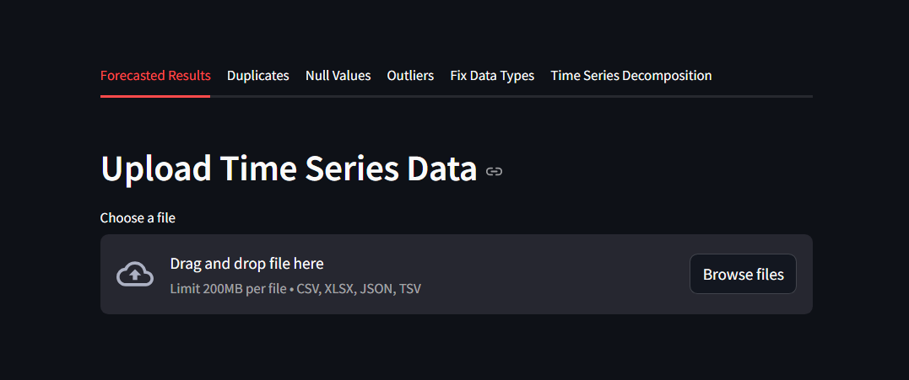
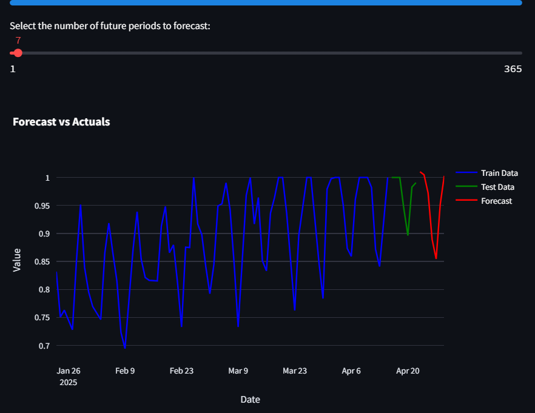

# ⏱️ Time Series Forecasting App

A fully interactive, end-to-end Streamlit application for univariate time series forecasting.  
Built for data analysts and business users to **upload, clean, analyze, and forecast** time series data without writing a single line of code.
https://time-series-forecaster.streamlit.app/
## 🖼️ Website Preview

## 🔍 Key Features

- **📂 Smart File Uploader**
  - Supports CSV, Excel, JSON, and TSV
  - Auto-detects and parses datetime columns
  - Handles messy formats gracefully with fallbacks

- **🧼 Data Cleaning**
  - Detects and removes duplicate rows & columns
  - Advanced missing value handling based on trend, seasonality, skewness, and correlation
  - Multi-method outlier detection (Z-score, IQR, Isolation Forest) with visual feedback
  - Allows custom data type fixing via UI

- **📈 Time Series Preparation**
  - User-defined frequency (Daily, Weekly, Monthly, etc.)
  - Resampling and interpolation to make data continuous
  - White noise detection using the Ljung-Box test
  - Stationarity testing and automatic differencing using ADF test

- **📊 Decomposition & Seasonality**
  - STL decomposition for trend/seasonality detection
  - Seasonality strength analysis to guide model choice

- **🧠 Model Selection & Forecasting**
  - Automatic detection of seasonality to choose between ARIMA and SARIMA
  - Hyperparameter tuning with AIC/BIC + RMSE evaluation
  - Forecasts converted back to original scale after differencing
  - Interactive Plotly visualizations comparing train/test/forecast

- **📥 Export Options**
  - Download cleaned data as CSV
  - (Optional: add forecast download support)

---

## 🧱 Project Structure

📦 time-series-forecasting-app/ ├── app.py # Main Streamlit app ├── modules/ │ ├── file_loader.py # File upload & parsing logic │ ├── data_cleaning.py # Cleaning, nulls, outliers, dtypes │ ├── data_preprocessing.py # Indexing, white noise, stationarity │ ├── decomposition.py # STL trend/seasonality decomposition │ ├── train_test_split.py # Data splitting & scaling │ ├── model_tuning.py # ARIMA/SARIMA tuning + forecasting │ └── utils.py # Helper methods for detection logic

---
